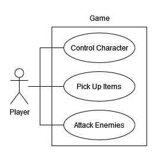
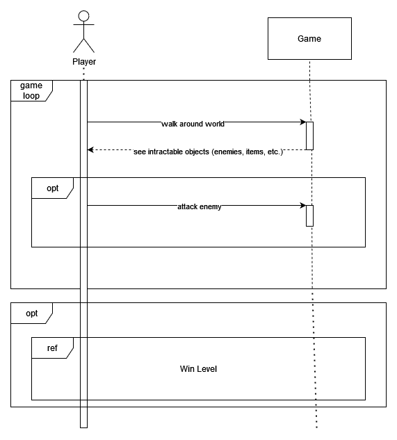

# Software Requirements and Design Document For Group 30
- Version 3.0

## Authors
- Jake Y
- Chris S
- Dion T

## 1. Overview (5 points)
<!-- Give a general overview of the system in 1-2 paragraphs (similar to the one in the project proposal). 

We’re developing a demo scale action adventure rpg with a mech theme. The system will include player movement mechanics, ranged and melee combat, and enemy behavior. -->

We’re developing a demo scale action adventure rpg with a mech theme. The system will include player movement mechanics, ranged and melee combat, and enemy behavior. 

## 2. Functional Requirements (10 points)
<!-- List the functional requirements in sentences identified by numbers and for each requirement state if it is of high, medium, or low priority. Each functional requirement is something that the system shall do. Include all the details required such that there can be no misinterpretations of the requirements when read. Be very specific about what the system needs to do (not how, just what). You may provide a brief design rationale for any requirement which you feel requires explanation for how and/or why the requirement was derived. -->

1. The player must be able to move.
2. The player must be able to make an attack that deals damage to an enemy character.
3. The player must be able to take damage from an enemy's attack.
    - Taking enough damage must lead to a fail state and a game over screen.
4. The player and enemies must be able to block attacks to avoid damage.
5. The player must be able to pick up equipment and equip it to change its stats.

## 3. Non-functional Requirements (10 points)
<!-- List the non-functional requirements of the system (any requirement referring to a property of the system, such as security, safety, software quality, performance, reliability, etc.) You may provide a brief rationale for any requirement which you feel requires explanation as to how and/or why the requirement was derived. -->

The system must run reasonably on consumer level hardware, reaching 30 to 60 fps consistently on an “average” computer (defined in our case as our computers).

## 4. Use Case Diagram (10 points)
<!-- This section presents the use case diagram and the textual descriptions of the use cases for the system under development. The use case diagram should contain all the use cases and relationships between them needed to describe the functionality to be developed. If you discover new use cases between two increments, update the diagram for your future increments.  

Textual descriptions of use cases: For the first increment, the textual descriptions for the use cases are not required. However, the textual descriptions for all use cases discovered for your system are required for the second and third iterations. -->

## 5. Class Diagram and/or Sequence Diagram (15 points)
<!-- This section presents a high-level overview of the anticipated system architecture using a class diagram and/or sequence diagrams.  

If the main paradigm used in your project is Object Oriented (i.e., you have classes or something that acts similar to classes in your system), then draw the Class Diagram of the entire system and Sequence Diagrams for the three (3) most important use cases in your system.  

If the main paradigm in your system is not Object Oriented (i.e., you do not have classes or anything similar to classes in your system) then only draw Sequence Diagrams, but for all the use cases of your system. In this case, we will use a modified version of Sequence Diagrams, where instead of objects, the lifelines will represent the functions in the system involved in the action sequence.  

Class Diagrams show the fundamental objects/classes that must be modeled with the system to satisfy its requirements and the relationships between them. Each class rectangle on the diagram must also include the attributes and the methods of the class (they can be refined between increments).  All the relationships between classes and their multiplicity must be shown on the class diagram.  

A Sequence Diagram simply depicts interaction between objects (or functions - in our case - for non-OOP systems) in a sequential order, i.e. the order in which these interactions take place. Sequence diagrams describe how and in what order the objects in a system function. -->

## 6. Operating Environment (5 points)
<!-- Describe the environment in which the software will operate, including the hardware platform, operating system and versions, and any other software components or applications with which it must peacefully coexist. -->

A Windows 10 PC. It must not interfere with any other software the user has installed on the system.

## 7. Assumptions and Dependencies (5 points)
<!-- List any assumed factors (as opposed to known facts) that could affect the requirements stated in this document. These could include third-party or commercial components that you plan to use, issues around the development or operating environment, or constraints. The project could be affected if these assumptions are incorrect, are not shared, or change. Also identify any dependencies the project has on external factors, such as software components that you intend to reuse from another project. -->

We depend on Unreal Engine 5 and the Gameplay Ability System Plugin. We assume that these are free to use for the lifetime of our project. We do not depend on these updating as we can stay on the same version without requiring new features.
